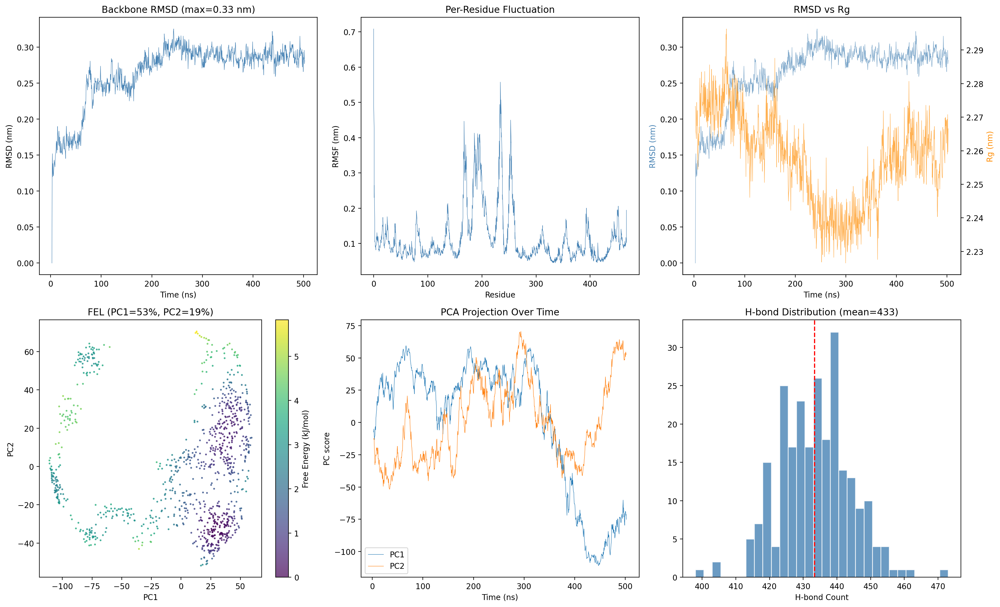

# MD Trajectory Analysis Tool

自动化分析 AMBER / GROMACS 分子动力学轨迹 | Python + MDTraj

## 功能

| 分析模块 | 描述 | 等效命令行 |
|---------|------|-----------|
| RMSD | 骨架均方根偏差 | `gmx rms` |
| RMSF | 每个残基的均方根波动 | `gmx rmsf` |
| Rg | 回转半径 | `gmx gyrate` |
| PCA | 主成分分析 + 自由能景观 | 手动GRACE画 |
| H-bond | 蛋白内部 + 配体-蛋白氢键 | `cpptraj hbond` |
| FEL | 自由能景观图 | 多步手动处理 |

## 使用

```bash
cd src
python md_analysis_tool.py
```

依赖: `mdtraj scikit-learn scipy matplotlib numpy`

## 输入

- AMBER 拓扑文件 (`.prmtop`)
- AMBER NetCDF 轨迹 (`.nc`) 或 GROMACS (`.xtc` + `.gro`)

## 输出



六合一分析图：RMSD | RMSF | Rg | 自由能景观 | PCA时间投影 | 氢键分布

## 作者

HuangJunbao — 药物化学硕士，计算生物学与AI药物化学方向
